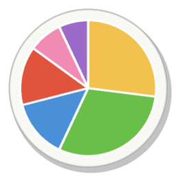
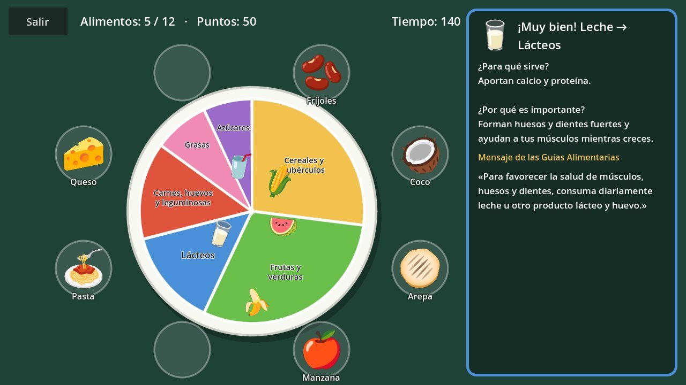

<div align="center">



# 🍽️ Mi Plato Saludable

### Producción de Videojuegos – Sistemas Interactivos 2026

**Universidad Antonio Nariño (UAN)**<br>
Facultad de Ingeniería de Sistemas y Computación

   

</div>

---

## 📝 Descripción del Proyecto

**Mi Plato Saludable** es un juego educativo para niños, desarrollado en **Godot Engine**, que enseña el **Plato saludable de la Familia Colombiana** de las Guías Alimentarias Basadas en Alimentos (GABA) del ICBF.

El plato aparece en el centro con sus **6 grupos de alimentos** y los alimentos alrededor. El niño ubica cada alimento en su grupo: si acierta, el juego le explica **para qué sirve ese grupo**, **por qué es importante** en la alimentación y le muestra **uno de los mensajes oficiales de las Guías Alimentarias**.

Este repositorio es el proyecto integrador del semestre 2026-2: el juego crece guía tras guía siguiendo buenas prácticas de ingeniería de software.



<sub>El plato interactivo con el panel de información · estado al cerrar la Guía 6</sub>

## 🎮 Cómo se juega

- **Armar mi plato**: **arrastra** cada alimento desde su puesto hasta su división del plato.
- Acierto: el alimento queda servido y el panel explica el grupo. Error: vuelve a su puesto y recibes una pista.
- Completa los 12 alimentos en 150 segundos; sin errores ganas una estrella.
- **Ganar estrellas**: minijuego de la canasta (A / D, flechas o botones en pantalla).

## 🥗 Los 6 grupos del plato

| Grupo | Color | Para qué sirve |
|---|:---:|---|
| Cereales, raíces, tubérculos y plátanos | 🟨 | Energía para el cuerpo y el cerebro |
| Frutas y verduras | 🟩 | Vitaminas, minerales y fibra |
| Leche y productos lácteos | 🟦 | Calcio y proteína para huesos y dientes |
| Carnes, huevos, leguminosas, frutos secos y semillas | 🟥 | Proteína, hierro y zinc |
| Grasas | 🩷 | Energía concentrada; en poca cantidad |
| Azúcares | 🟪 | Energía rápida; la porción más pequeña |

## 🗺️ Avance por guías de laboratorio

| Guía | Tema | Qué se agregó al juego | Estado |
|:---:|---|---|:---:|
| 1 | Entorno y arquitectura base | Proyecto inicial, estructura `src/` y primer menú. | ✅ |
| 2 | Escenas, nodos y co-localización | Menú y pantalla para conocer los 6 grupos del plato con `.bind()`. | ✅ |
| 3 | Navegación desacoplada (Event Bus) | `EventBus`, orquestador `MainApp`, Configuración y Créditos. | ✅ |
| 4 | Estado global y ButtonNav | `GlobalManager` con los datos del plato; primera versión jugable por botones. | ✅ |
| 5 | Entrada, movimiento y mecánicas | Minijuego *Atrapa frutas y verduras* y estrellas de bonificación. | ✅ |
| 6 | Máquinas de estado y Tweens | El plato interactivo: arrastrar cada alimento a su grupo. | ✅ |
| 7 | Vertical Slice, persistencia y Web | Progreso guardado, diseño final, álbum de grupos y versión Web. | ⏳ |

Cada guía se desarrolla en su propia rama `lab-N`, se fusiona en `main` y se marca con la etiqueta `lab-N-final`.

## 🏗️ Arquitectura

- Cada pantalla vive en su carpeta con su escena `.tscn` y su script `.gd` (co-localización).
- Señales conectadas por código con `@onready` + `.connect()` y un callback reutilizado con `.bind()`.
- **`EventBus`** (Autoload): señales globales; las pantallas solo emiten intenciones (patrón Observer).
- **`MainApp`**: única escena principal; instancia y libera pantallas dentro de `SceneContainer`.
- **`GlobalManager`** (Autoload): datos del plato (grupos, alimentos, mensajes GABA) y estado de la ronda.
- **`ButtonNav`**: botón de navegación reutilizable configurado desde el Inspector; historial como pila.
- El minijuego es un módulo independiente: publica `bonus_obtained` y `GlobalManager` aplica las reglas de las estrellas.
- Entrada por acciones del Input Map (`move_left`, `move_right`), no por teclas fijas.
- Cada alimento tiene una **máquina de estados finita**: `APARECIENDO → DISPONIBLE → ARRASTRANDO → UBICADO / RECHAZADO`.
- Animaciones con **Tween** elegidas según la transición (estado anterior → actual).

## 📁 Estructura de Directorios del Repositorio

```
src/
├── assets/
│   └── foods/
├── components/
│   └── navigation/
├── core/
└── scenes/
    ├── config/
    ├── credits/
    ├── gamification/
    │   └── catch_food/
    ├── main/
    └── plate_process/
        └── plate_game/
doc/
├── adr/      Registros de decisiones de arquitectura (ADR)
├── guias/    Qué se aplicó de cada guía
└── img/      Capturas para este README
DEVLOG.md     Bitácora de desarrollo
```

Todos los archivos y carpetas usan `snake_case`, y cada escena vive junto a su script.

## ⚙️ Tecnologías Utilizadas

- **Engine:** Godot Engine 4.7 (renderizador *Compatibility* para portabilidad web)
- **Lenguaje:** GDScript 2.0 (tipado estricto)
- **Versionamiento:** Git / GitHub con ramas por guía y Conventional Commits
- **Documentación:** ADR + DEVLOG

## ▶️ Cómo abrir el proyecto

1. Instala **Godot Engine 4.7** (versión *Standard*).
2. Clona el repositorio:
   ```bash
   git clone https://github.com/Rcongo01/produccion-videojuegos-2026-2.git
   ```
3. En el **Project Manager** de Godot: **Importar** → selecciona `project.godot` → **Importar y Editar**.
4. Presiona **F5** para jugar.

Para ver el proyecto tal como quedó al terminar una guía: `git checkout lab-N-final`.

## 🏷️ Versiones

`lab-1` · `lab-2` · `lab-2-final` · `lab-3-final` · `lab-4-final` · `lab-5-final` · `lab-6-final`

## 📚 Documentación

- [`DEVLOG.md`](DEVLOG.md): bitácora de desarrollo, una entrada por guía.
- [`doc/guias/guia_02_colocalizacion.md`](doc/guias/guia_02_colocalizacion.md): qué pide la Guía 2 y cómo se aplicó al juego.
- [`doc/guias/guia_03_event_bus.md`](doc/guias/guia_03_event_bus.md): qué pide la Guía 3 y cómo se aplicó al juego.
- [`doc/guias/guia_04_global_manager.md`](doc/guias/guia_04_global_manager.md): qué pide la Guía 4 y cómo se aplicó al juego.
- [`doc/guias/guia_05_entrada_mecanicas.md`](doc/guias/guia_05_entrada_mecanicas.md): qué pide la Guía 5 y cómo se aplicó al juego.
- [`doc/guias/guia_06_fsm_tweens.md`](doc/guias/guia_06_fsm_tweens.md): qué pide la Guía 6 y cómo se aplicó al juego.
- Decisiones de arquitectura: [ADR-001](doc/adr/ADR-001-colocalizacion.md), [ADR-002](doc/adr/ADR-002-event-bus-navegacion.md), [ADR-003](doc/adr/ADR-003-global-manager-button-nav.md), [ADR-004](doc/adr/ADR-004-gamificacion-recompensas.md), [ADR-005](doc/adr/ADR-005-fsm-animaciones.md).

## 📜 Créditos y licencias

- Contenido educativo: *Guías Alimentarias Basadas en Alimentos para la población colombiana mayor de 2 años* (ICBF – FAO) y su **Plato saludable de la Familia Colombiana**.
- Íconos de alimentos: generados a partir de **Noto Color Emoji** (SIL Open Font License 1.1).

## 👨‍💻 Autor

- **Nombre:** Ronaldo Congo Cancelado
- **Código Estudiantil:** 12242622951
- **Programa:** Ingeniería de Software
- **Repositorio:** [Rcongo01/produccion-videojuegos-2026-2](https://github.com/Rcongo01/produccion-videojuegos-2026-2)
